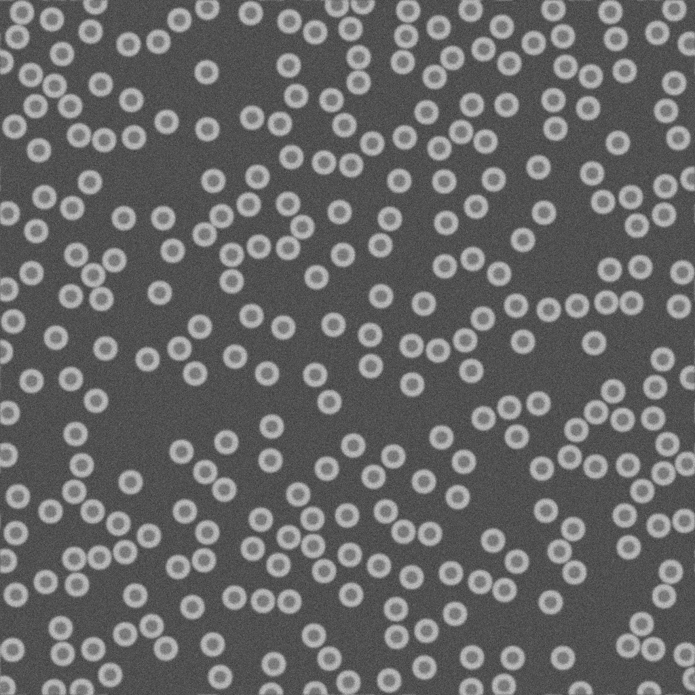

# TEM staining comparison

[](https://results.pre-commit.ci/latest/github/dv-bt/tem-staining-comparison/main)

This repository contains code used to generate synthetic data and perform spectral analysis for the paper *Systematic Comparison of Commercial Uranyl-Alternative Stains for Negative- and Positive-Staining Transmission Electron Microscopy of Organic Specimens* by Vera M. Kissling, Stephanie Eitner, Davide Bottone, Gea Cereghetti, and Peter Wick (**under review**)

## Installation

The `tem-staining` package can be installed directly from this repository. We recommend installing it in a fresh environment.
```
pip install tem-staining@git+https://github.com/dv-bt/tem-staining-comparison
```

## Usage

The functions in the `synthetic_data` module can be used to generate synthetic images of ferritin rings. A random state can also be set to obtain reproducible results.
```python
from tem_staining.synthetic_data import generate_ferritin_rings
import cv2

image, ring_centers = generate_ferritin_rings(
    image_width=1024,
    areal_fraction=0.3,
    background_value=80,
    random_state=12743672,
    pixel_size=0.3e-9,
)

cv2.imwrite("example_image.png", image)
```



## Acknowledgements

This work was financed by the MetrINo project (23.00360, 22HLT04). The project received funding from the European Partnership on Metrology, co-financed by the European Union's Horizon Europe Research and Innovation Programme and SERI (REF-1131-52104)
